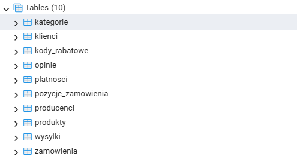
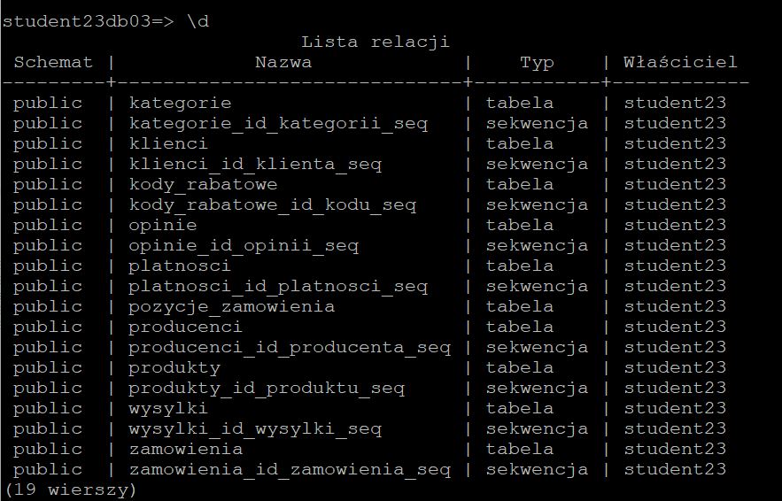
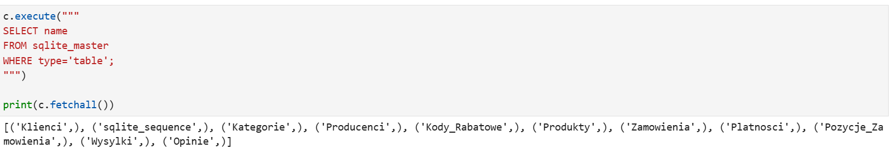

=========================================
Implementacja Bazy Danych
=========================================

:Autorzy:
    1. Oskar Wrona
    2. Kamil Lewandowski
    3. Adam Tarkowski

1. Implementacja fizycznych schematów
=====================================

Schemat bazy zaimplementowano w dwóch wariantach: dla PostgreSQL oraz SQLite.
Obie wersje zachowują ten sam układ tabel, kluczy głównych i obcych oraz
podstawowych więzów integralności. Różnice dotyczą przede wszystkim typów danych
i sposobu automatycznego generowania identyfikatorów.

.. figure:: schemat_fizyczny_postgres.png
   :align: center
   :alt: Model fizyczny ERD dla PostgreSQL

   Rysunek 1: Fizyczny schemat bazy danych opracowany dla silnika PostgreSQL.

.. figure:: schemat_fizyczny_sqlite.png
   :align: center
   :alt: Model fizyczny ERD dla SQLite

   Rysunek 2: Fizyczny schemat bazy danych opracowany dla silnika SQLite.

Kod SQL dla PostgreSQL
----------------------

Ten sam skrypt jest dostępny jako osobny plik:
:download:`utworz_baze_postgresql.sql <utworz_baze_postgresql.sql>`.

.. code-block:: sql

   -- =========================================
   -- TWORZENIE TABEL - SKLEP INTERNETOWY
   -- PostgreSQL / pgAdmin
   -- =========================================

   -- Usuwanie tabel jeśli istnieją
   DROP TABLE IF EXISTS Opinie CASCADE;
   DROP TABLE IF EXISTS Wysylki CASCADE;
   DROP TABLE IF EXISTS Platnosci CASCADE;
   DROP TABLE IF EXISTS Pozycje_Zamowienia CASCADE;
   DROP TABLE IF EXISTS Zamowienia CASCADE;
   DROP TABLE IF EXISTS Produkty CASCADE;
   DROP TABLE IF EXISTS Kody_Rabatowe CASCADE;
   DROP TABLE IF EXISTS Kategorie CASCADE;
   DROP TABLE IF EXISTS Producenci CASCADE;
   DROP TABLE IF EXISTS Klienci CASCADE;

   -- =========================================
   -- TABELA: Klienci
   -- =========================================
   CREATE TABLE Klienci (
      ID_Klienta SERIAL PRIMARY KEY,
      Imie VARCHAR(50) NOT NULL,
      Nazwisko VARCHAR(50) NOT NULL,
      Email VARCHAR(255) UNIQUE NOT NULL,
      Telefon VARCHAR(15),
      Miasto VARCHAR(100),
      Ulica VARCHAR(150),
      Kod_Pocztowy VARCHAR(10)
   );

   -- =========================================
   -- TABELA: Kategorie
   -- =========================================
   CREATE TABLE Kategorie (
      ID_Kategorii SERIAL PRIMARY KEY,
      Nazwa_kategorii VARCHAR(50) NOT NULL
   );

   -- =========================================
   -- TABELA: Producenci
   -- =========================================
   CREATE TABLE Producenci (
      ID_Producenta SERIAL PRIMARY KEY,
      Nazwa_producenta VARCHAR(100) NOT NULL,
      Kraj_pochodzenia VARCHAR(50)
   );

   -- =========================================
   -- TABELA: Kody_Rabatowe
   -- =========================================
   CREATE TABLE Kody_Rabatowe (
      ID_Kodu SERIAL PRIMARY KEY,
      Kod_tekstowy VARCHAR(20) UNIQUE NOT NULL,
      Znizka_procentowa SMALLINT CHECK (Znizka_procentowa BETWEEN 0 AND 100)
   );

   -- =========================================
   -- TABELA: Produkty
   -- =========================================
   CREATE TABLE Produkty (
      ID_Produktu SERIAL PRIMARY KEY,
      ID_Kategorii INTEGER NOT NULL,
      ID_Producenta INTEGER NOT NULL,
      Nazwa VARCHAR(150) NOT NULL,
      Opis TEXT,
      Cena_aktualna NUMERIC(10,2) NOT NULL CHECK (Cena_aktualna >= 0),
      Stan_magazynowy INTEGER NOT NULL DEFAULT 0 CHECK (Stan_magazynowy >= 0),

      CONSTRAINT fk_produkty_kategorie
         FOREIGN KEY (ID_Kategorii)
         REFERENCES Kategorie(ID_Kategorii)
         ON DELETE RESTRICT,

      CONSTRAINT fk_produkty_producenci
         FOREIGN KEY (ID_Producenta)
         REFERENCES Producenci(ID_Producenta)
         ON DELETE RESTRICT
   );

   -- =========================================
   -- TABELA: Zamowienia
   -- =========================================
   CREATE TABLE Zamowienia (
      ID_Zamowienia SERIAL PRIMARY KEY,
      ID_Klienta INTEGER NOT NULL,
      ID_Kodu INTEGER,
      Data_zamowienia TIMESTAMP NOT NULL DEFAULT CURRENT_TIMESTAMP,
      Status_zamowienia VARCHAR(30) NOT NULL,

      CONSTRAINT fk_zamowienia_klienci
         FOREIGN KEY (ID_Klienta)
         REFERENCES Klienci(ID_Klienta)
         ON DELETE CASCADE,

      CONSTRAINT fk_zamowienia_kody
         FOREIGN KEY (ID_Kodu)
         REFERENCES Kody_Rabatowe(ID_Kodu)
         ON DELETE SET NULL
   );

   -- =========================================
   -- TABELA: Platnosci
   -- =========================================
   CREATE TABLE Platnosci (
      ID_Platnosci SERIAL PRIMARY KEY,
      ID_Zamowienia INTEGER UNIQUE NOT NULL,
      Metoda_platnosci VARCHAR(50) NOT NULL,
      Status_platnosci VARCHAR(30) NOT NULL,

      CONSTRAINT fk_platnosci_zamowienia
         FOREIGN KEY (ID_Zamowienia)
         REFERENCES Zamowienia(ID_Zamowienia)
         ON DELETE CASCADE
   );

   -- =========================================
   -- TABELA: Pozycje_Zamowienia
   -- =========================================
   CREATE TABLE Pozycje_Zamowienia (
      ID_Zamowienia INTEGER NOT NULL,
      ID_Produktu INTEGER NOT NULL,
      Ilosc INTEGER NOT NULL CHECK (Ilosc > 0),
      Cena_historyczna NUMERIC(10,2) NOT NULL CHECK (Cena_historyczna >= 0),

      PRIMARY KEY (ID_Zamowienia, ID_Produktu),

      CONSTRAINT fk_pozycje_zamowienia
         FOREIGN KEY (ID_Zamowienia)
         REFERENCES Zamowienia(ID_Zamowienia)
         ON DELETE CASCADE,

      CONSTRAINT fk_pozycje_produkty
         FOREIGN KEY (ID_Produktu)
         REFERENCES Produkty(ID_Produktu)
         ON DELETE CASCADE
   );

   -- =========================================
   -- TABELA: Wysylki
   -- =========================================
   CREATE TABLE Wysylki (
      ID_Wysylki SERIAL PRIMARY KEY,
      ID_Zamowienia INTEGER UNIQUE NOT NULL,
      Firma_kurierska VARCHAR(100),
      Numer_listu VARCHAR(100) UNIQUE,
      Status_paczki VARCHAR(50),

      CONSTRAINT fk_wysylki_zamowienia
         FOREIGN KEY (ID_Zamowienia)
         REFERENCES Zamowienia(ID_Zamowienia)
         ON DELETE CASCADE
   );

   -- =========================================
   -- TABELA: Opinie
   -- =========================================
   CREATE TABLE Opinie (
      ID_Opinii SERIAL PRIMARY KEY,
      ID_Zamowienia INTEGER NOT NULL,
      ID_Produktu INTEGER NOT NULL,
      Ocena SMALLINT NOT NULL CHECK (Ocena BETWEEN 1 AND 5),
      Komentarz TEXT,

      CONSTRAINT fk_opinie_pozycje
         FOREIGN KEY (ID_Zamowienia, ID_Produktu)
         REFERENCES Pozycje_Zamowienia(ID_Zamowienia, ID_Produktu)
         ON DELETE CASCADE,

      CONSTRAINT uq_opinie_pozycja
         UNIQUE (ID_Zamowienia, ID_Produktu)
   );

   -- =========================================
   -- INDEKSY
   -- =========================================

   CREATE INDEX idx_produkty_kategoria
   ON Produkty(ID_Kategorii);

   CREATE INDEX idx_produkty_producent
   ON Produkty(ID_Producenta);

   CREATE INDEX idx_zamowienia_klient
   ON Zamowienia(ID_Klienta);

   CREATE INDEX idx_pozycje_produkt
   ON Pozycje_Zamowienia(ID_Produktu);

   CREATE INDEX idx_platnosci_zamowienie
   ON Platnosci(ID_Zamowienia);

   CREATE INDEX idx_wysylki_zamowienie
   ON Wysylki(ID_Zamowienia);

Reprezentacja bazy danych w pgadmin na zdalnym serwerze:

   Rysunek 3: Lista tabel utworzonych na zdalnym serwerze PostgreSQL w pgAdmin.

Reprezentacja bazy danych w psql na lokalnym serwerze:

   Rysunek 4: Lista relacji bazy danych wyświetlona lokalnie w programie psql.

Kod SQL dla SQLite
------------------

Ten sam skrypt jest dostępny jako osobny plik:
:download:`utworz_baze_sqlite.sql <utworz_baze_sqlite.sql>`.

.. code-block:: sql

    -- =========================================
    -- TWORZENIE TABEL - SKLEP INTERNETOWY
    -- SQLite
    -- =========================================

    PRAGMA foreign_keys = ON;

    -- Usuwanie tabel jeśli istnieją
    DROP TABLE IF EXISTS Opinie;
    DROP TABLE IF EXISTS Wysylki;
    DROP TABLE IF EXISTS Platnosci;
    DROP TABLE IF EXISTS Pozycje_Zamowienia;
    DROP TABLE IF EXISTS Zamowienia;
    DROP TABLE IF EXISTS Produkty;
    DROP TABLE IF EXISTS Kody_Rabatowe;
    DROP TABLE IF EXISTS Kategorie;
    DROP TABLE IF EXISTS Producenci;
    DROP TABLE IF EXISTS Klienci;

    -- =========================================
    -- TABELA: Klienci
    -- =========================================
    CREATE TABLE Klienci (
        ID_Klienta INTEGER PRIMARY KEY AUTOINCREMENT,
        Imie TEXT NOT NULL,
        Nazwisko TEXT NOT NULL,
        Email TEXT UNIQUE NOT NULL,
        Telefon TEXT,
        Miasto TEXT,
        Ulica TEXT,
        Kod_Pocztowy TEXT
    );

    -- =========================================
    -- TABELA: Kategorie
    -- =========================================
    CREATE TABLE Kategorie (
        ID_Kategorii INTEGER PRIMARY KEY AUTOINCREMENT,
        Nazwa_kategorii TEXT NOT NULL
    );

    -- =========================================
    -- TABELA: Producenci
    -- =========================================
    CREATE TABLE Producenci (
        ID_Producenta INTEGER PRIMARY KEY AUTOINCREMENT,
        Nazwa_producenta TEXT NOT NULL,
        Kraj_pochodzenia TEXT
    );

    -- =========================================
    -- TABELA: Kody_Rabatowe
    -- =========================================
    CREATE TABLE Kody_Rabatowe (
        ID_Kodu INTEGER PRIMARY KEY AUTOINCREMENT,
        Kod_tekstowy TEXT UNIQUE NOT NULL,
        Znizka_procentowa INTEGER
            CHECK (Znizka_procentowa BETWEEN 0 AND 100)
    );

    -- =========================================
    -- TABELA: Produkty
    -- =========================================
    CREATE TABLE Produkty (
        ID_Produktu INTEGER PRIMARY KEY AUTOINCREMENT,
        ID_Kategorii INTEGER NOT NULL,
        ID_Producenta INTEGER NOT NULL,
        Nazwa TEXT NOT NULL,
        Opis TEXT,
        Cena_aktualna REAL NOT NULL
            CHECK (Cena_aktualna >= 0),
        Stan_magazynowy INTEGER NOT NULL DEFAULT 0
            CHECK (Stan_magazynowy >= 0),

        FOREIGN KEY (ID_Kategorii)
            REFERENCES Kategorie(ID_Kategorii)
            ON DELETE RESTRICT,

        FOREIGN KEY (ID_Producenta)
            REFERENCES Producenci(ID_Producenta)
            ON DELETE RESTRICT
    );

    -- =========================================
    -- TABELA: Zamowienia
    -- =========================================
    CREATE TABLE Zamowienia (
        ID_Zamowienia INTEGER PRIMARY KEY AUTOINCREMENT,
        ID_Klienta INTEGER NOT NULL,
        ID_Kodu INTEGER,
        Data_zamowienia DATETIME NOT NULL DEFAULT CURRENT_TIMESTAMP,
        Status_zamowienia TEXT NOT NULL,

        FOREIGN KEY (ID_Klienta)
            REFERENCES Klienci(ID_Klienta)
            ON DELETE CASCADE,

        FOREIGN KEY (ID_Kodu)
            REFERENCES Kody_Rabatowe(ID_Kodu)
            ON DELETE SET NULL
    );

    -- =========================================
    -- TABELA: Platnosci
    -- =========================================
    CREATE TABLE Platnosci (
        ID_Platnosci INTEGER PRIMARY KEY AUTOINCREMENT,
        ID_Zamowienia INTEGER UNIQUE NOT NULL,
        Metoda_platnosci TEXT NOT NULL,
        Status_platnosci TEXT NOT NULL,

        FOREIGN KEY (ID_Zamowienia)
            REFERENCES Zamowienia(ID_Zamowienia)
            ON DELETE CASCADE
    );

    -- =========================================
    -- TABELA: Pozycje_Zamowienia
    -- =========================================
    CREATE TABLE Pozycje_Zamowienia (
        ID_Zamowienia INTEGER NOT NULL,
        ID_Produktu INTEGER NOT NULL,
        Ilosc INTEGER NOT NULL
            CHECK (Ilosc > 0),
        Cena_historyczna REAL NOT NULL
            CHECK (Cena_historyczna >= 0),

        PRIMARY KEY (ID_Zamowienia, ID_Produktu),

        FOREIGN KEY (ID_Zamowienia)
            REFERENCES Zamowienia(ID_Zamowienia)
            ON DELETE CASCADE,

        FOREIGN KEY (ID_Produktu)
            REFERENCES Produkty(ID_Produktu)
            ON DELETE CASCADE
    );

    -- =========================================
    -- TABELA: Wysylki
    -- =========================================
    CREATE TABLE Wysylki (
        ID_Wysylki INTEGER PRIMARY KEY AUTOINCREMENT,
        ID_Zamowienia INTEGER UNIQUE NOT NULL,
        Firma_kurierska TEXT,
        Numer_listu TEXT UNIQUE,
        Status_paczki TEXT,

        FOREIGN KEY (ID_Zamowienia)
            REFERENCES Zamowienia(ID_Zamowienia)
            ON DELETE CASCADE
    );

    -- =========================================
    -- TABELA: Opinie
    -- =========================================
    CREATE TABLE Opinie (
        ID_Opinii INTEGER PRIMARY KEY AUTOINCREMENT,
        ID_Zamowienia INTEGER NOT NULL,
        ID_Produktu INTEGER NOT NULL,
        Ocena INTEGER NOT NULL
            CHECK (Ocena BETWEEN 1 AND 5),
        Komentarz TEXT,

        FOREIGN KEY (ID_Zamowienia, ID_Produktu)
            REFERENCES Pozycje_Zamowienia(ID_Zamowienia, ID_Produktu)
            ON DELETE CASCADE,

        UNIQUE (ID_Zamowienia, ID_Produktu)
    );

    -- =========================================
    -- INDEKSY
    -- =========================================

    CREATE INDEX idx_produkty_kategoria
    ON Produkty(ID_Kategorii);

    CREATE INDEX idx_produkty_producent
    ON Produkty(ID_Producenta);

    CREATE INDEX idx_zamowienia_klient
    ON Zamowienia(ID_Klienta);

    CREATE INDEX idx_pozycje_produkt
    ON Pozycje_Zamowienia(ID_Produktu);

    CREATE INDEX idx_platnosci_zamowienie
    ON Platnosci(ID_Zamowienia);

    CREATE INDEX idx_wysylki_zamowienie
    ON Wysylki(ID_Zamowienia);

Reprezentacja bazy danych w sqlite:

   Rysunek 5: Lista tabel utworzonych w bazie SQLite w środowisku JupyterHub.

2. Skrypt do wprowadzania danych do bazy danych
===============================================

Wybór mechanizmu importu
------------------------

Do wsadowego zasilania obu baz wybrano plik CSV oraz skrypty napisane
w języku Python. Takie rozwiązanie pozwala wykorzystać ten sam zestaw danych
wejściowych dla PostgreSQL i SQLite, a jednocześnie przeprowadzić walidację
wartości przed wykonaniem instrukcji ``INSERT``. W pliku przyjęto separator
średnikowy, ponieważ dane tekstowe mogą zawierać przecinki.

Każdy wiersz CSV opisuje jedną pozycję zamówienia. Pole
``ID_Zamowienia`` jest obowiązkowe i musi mieć tę samą wartość we wszystkich
wierszach należących do jednego zamówienia. Dzięki temu kilka produktów
kupionych w ramach jednej transakcji nie jest błędnie interpretowanych jako
kilka oddzielnych zamówień. Informacje dotyczące klienta, płatności i wysyłki
mogą powtarzać się w takich wierszach, ale skrypt zapisuje odpowiadające im
rekordy tylko raz.

W przypadku PostgreSQL identyfikatory pomocnicze są pobierane z sekwencji
powiązanych z kolumnami typu ``SERIAL``. Po zakończeniu importu sekwencje są
synchronizowane również z identyfikatorami przekazanymi jawnie w pliku CSV.
W SQLite brakujące identyfikatory są wyznaczane podczas sekwencyjnego importu
prowadzonego w ramach jednego połączenia, a kolumny kluczy głównych korzystają
z mechanizmu ``AUTOINCREMENT``. Po otwarciu połączenia włączana jest ponadto
obsługa kluczy obcych za pomocą ``PRAGMA foreign_keys = ON``.

Do PostgreSQL
-------------

Samodzielny skrypt importujący jest dostępny w pliku:
:download:`import_postgresql.py <import_postgresql.py>`.

.. code-block:: python

    import csv
    import simplejson
    from sqlalchemy import create_engine, text

    # ============================================================
    # KONFIGURACJA
    # ============================================================

    SCIEZKA_CSV = "dane_plaskie.csv"
    SEPARATOR = ";"
    SCIEZKA_CREDS = "./database_creds.json"

    # ============================================================
    # POŁĄCZENIE Z POSTGRESQL
    # ============================================================

    with open(SCIEZKA_CREDS, encoding="utf-8") as db_con_file:
        creds = simplejson.loads(db_con_file.read())

    connection_string = (
        "postgresql+psycopg://"
        + creds["user_name"]
        + ":"
        + creds["password"]
        + "@"
        + creds["host_name"]
        + ":"
        + creds["port_number"]
        + "/"
        + creds["db_name"]
    )

    dbEngine = create_engine(connection_string)

    # ============================================================
    # FUNKCJE POMOCNICZE
    # ============================================================

    def puste(x):
        return x is None or str(x).strip() == "" or str(x).strip().lower() == "nan"

    def wartosc(row, nazwa, domyslna=None):
        x = row.get(nazwa, domyslna)
        if puste(x):
            return domyslna
        return str(x).strip()

    def liczba(row, nazwa, domyslna=None):
        x = wartosc(row, nazwa, domyslna)
        if x is None:
            return None
        return int(float(str(x).replace(",", ".")))

    def kwota(row, nazwa, domyslna=None):
        x = wartosc(row, nazwa, domyslna)
        if x is None:
            return None
        return float(str(x).replace(",", "."))

    def istnieje(connection, tabela, warunek):
        warunki = [f"{k.lower()} = :{k}" for k in warunek.keys()]

        polecenie = f"""
        SELECT 1
        FROM {tabela.lower()}
        WHERE {" AND ".join(warunki)}
        LIMIT 1
        """

        wynik = connection.execute(text(polecenie), warunek).first()
        return wynik is not None

    def pobierz_id(connection, tabela, kolumna_id, warunek):
        warunki = [f"{k.lower()} = :{k}" for k in warunek.keys()]

        polecenie = f"""
        SELECT {kolumna_id.lower()}
        FROM {tabela.lower()}
        WHERE {" AND ".join(warunki)}
        LIMIT 1
        """

        wynik = connection.execute(text(polecenie), warunek).first()

        if wynik:
            return wynik[0]

        return None

    def next_id(connection, tabela, kolumna_id):
        polecenie = f"""
        SELECT nextval(
            pg_get_serial_sequence(
                '{tabela.lower()}',
                '{kolumna_id.lower()}'
            )
        )
        """

        return connection.execute(text(polecenie)).scalar()

    def synchronizuj_sekwencje(connection):
        tabele = {
            "Klienci": "ID_Klienta",
            "Kategorie": "ID_Kategorii",
            "Producenci": "ID_Producenta",
            "Kody_Rabatowe": "ID_Kodu",
            "Produkty": "ID_Produktu",
            "Zamowienia": "ID_Zamowienia",
            "Platnosci": "ID_Platnosci",
            "Wysylki": "ID_Wysylki",
            "Opinie": "ID_Opinii",
        }

        for tabela, kolumna_id in tabele.items():
            polecenie = f"""
            SELECT setval(
                pg_get_serial_sequence(
                    '{tabela.lower()}',
                    '{kolumna_id.lower()}'
                ),
                COALESCE(MAX({kolumna_id.lower()}), 1),
                MAX({kolumna_id.lower()}) IS NOT NULL
            )
            FROM {tabela.lower()}
            """

            connection.execute(text(polecenie))

    def insert(connection, tabela, dane):
        dane = {k: v for k, v in dane.items() if v is not None}

        if not dane:
            return

        kolumny = ", ".join([k.lower() for k in dane.keys()])
        parametry = ", ".join([f":{k}" for k in dane.keys()])

        polecenie = f"""
        INSERT INTO {tabela.lower()} ({kolumny})
        VALUES ({parametry})
        """

        connection.execute(text(polecenie), dane)

    # ============================================================
    # IMPORT JEDNEGO WIERSZA
    # ============================================================

    def importuj_wiersz(connection, row):
        # Pominięcie przypadkowo wklejonego nagłówka w środku pliku
        if wartosc(row, "ID_Klienta") == "ID_Klienta":
            return "Pominięto powtórzony nagłówek"

        # ========================================================
        # KLIENCI
        # ========================================================

        id_klienta = liczba(row, "ID_Klienta")

        if id_klienta is None and wartosc(row, "Email") is not None:
            id_klienta = pobierz_id(
                connection,
                "Klienci",
                "ID_Klienta",
                {"Email": wartosc(row, "Email")}
            )

        if id_klienta is None and wartosc(row, "Imie") is not None:
            id_klienta = next_id(connection, "Klienci", "ID_Klienta")

        if id_klienta is not None:
            if not istnieje(connection, "Klienci", {"ID_Klienta": id_klienta}):
                insert(connection, "Klienci", {
                    "ID_Klienta": id_klienta,
                    "Imie": wartosc(row, "Imie"),
                    "Nazwisko": wartosc(row, "Nazwisko"),
                    "Email": wartosc(row, "Email"),
                    "Telefon": wartosc(row, "Telefon"),
                    "Miasto": wartosc(row, "Miasto"),
                    "Ulica": wartosc(row, "Ulica"),
                    "Kod_Pocztowy": wartosc(row, "Kod_Pocztowy"),
                })

        # ========================================================
        # KATEGORIE
        # ========================================================

        id_kategorii = liczba(row, "ID_Kategorii")

        if id_kategorii is None and wartosc(row, "Kategoria") is not None:
            id_kategorii = pobierz_id(
                connection,
                "Kategorie",
                "ID_Kategorii",
                {"Nazwa_kategorii": wartosc(row, "Kategoria")}
            )

        if id_kategorii is None and wartosc(row, "Kategoria") is not None:
            id_kategorii = next_id(connection, "Kategorie", "ID_Kategorii")

        if id_kategorii is not None:
            if not istnieje(connection, "Kategorie", {"ID_Kategorii": id_kategorii}):
                insert(connection, "Kategorie", {
                    "ID_Kategorii": id_kategorii,
                    "Nazwa_kategorii": wartosc(row, "Kategoria"),
                })

        # ========================================================
        # PRODUCENCI
        # ========================================================

        id_producenta = liczba(row, "ID_Producenta")

        if id_producenta is None and wartosc(row, "Producent") is not None:
            id_producenta = pobierz_id(
                connection,
                "Producenci",
                "ID_Producenta",
                {"Nazwa_producenta": wartosc(row, "Producent")}
            )

        if id_producenta is None and wartosc(row, "Producent") is not None:
            id_producenta = next_id(connection, "Producenci", "ID_Producenta")

        if id_producenta is not None:
            if not istnieje(connection, "Producenci", {"ID_Producenta": id_producenta}):
                insert(connection, "Producenci", {
                    "ID_Producenta": id_producenta,
                    "Nazwa_producenta": wartosc(row, "Producent"),
                    "Kraj_pochodzenia": wartosc(row, "Kraj_Producenta"),
                })

        # ========================================================
        # KODY RABATOWE
        # ========================================================

        id_kodu = liczba(row, "ID_Kodu")

        if id_kodu is None and wartosc(row, "Kod_Rabatowy") is not None:
            id_kodu = pobierz_id(
                connection,
                "Kody_Rabatowe",
                "ID_Kodu",
                {"Kod_tekstowy": wartosc(row, "Kod_Rabatowy")}
            )

        if id_kodu is None and wartosc(row, "Kod_Rabatowy") is not None:
            id_kodu = next_id(connection, "Kody_Rabatowe", "ID_Kodu")

        if id_kodu is not None:
            znizka = liczba(row, "Znizka")

            if znizka is not None and (znizka < 0 or znizka > 100):
                raise ValueError("Zniżka procentowa musi być w zakresie od 0 do 100")

            if not istnieje(connection, "Kody_Rabatowe", {"ID_Kodu": id_kodu}):
                insert(connection, "Kody_Rabatowe", {
                    "ID_Kodu": id_kodu,
                    "Kod_tekstowy": wartosc(row, "Kod_Rabatowy"),
                    "Znizka_procentowa": znizka,
                })

        # ========================================================
        # PRODUKTY
        # ========================================================

        id_produktu = liczba(row, "ID_Produktu")

        if id_produktu is None and wartosc(row, "Nazwa_Produktu") is not None:
            id_produktu = pobierz_id(
                connection,
                "Produkty",
                "ID_Produktu",
                {"Nazwa": wartosc(row, "Nazwa_Produktu")}
            )

        if id_produktu is None and wartosc(row, "Nazwa_Produktu") is not None:
            id_produktu = next_id(connection, "Produkty", "ID_Produktu")

        if id_produktu is not None:
            if id_kategorii is None:
                raise ValueError("Produkt nie ma kategorii")

            if id_producenta is None:
                raise ValueError("Produkt nie ma producenta")

            if not istnieje(connection, "Kategorie", {"ID_Kategorii": id_kategorii}):
                raise ValueError("Nie można dodać produktu, bo kategoria nie istnieje")

            if not istnieje(connection, "Producenci", {"ID_Producenta": id_producenta}):
                raise ValueError("Nie można dodać produktu, bo producent nie istnieje")

            cena = kwota(row, "Cena_Aktualna")
            stan = liczba(row, "Stan_Magazynowy")

            if cena is not None and cena < 0:
                raise ValueError("Cena aktualna nie może być ujemna")

            if stan is not None and stan < 0:
                raise ValueError("Stan magazynowy nie może być ujemny")

            if not istnieje(connection, "Produkty", {"ID_Produktu": id_produktu}):
                insert(connection, "Produkty", {
                    "ID_Produktu": id_produktu,
                    "ID_Kategorii": id_kategorii,
                    "ID_Producenta": id_producenta,
                    "Nazwa": wartosc(row, "Nazwa_Produktu"),
                    "Opis": wartosc(row, "Opis"),
                    "Cena_aktualna": cena,
                    "Stan_magazynowy": stan,
                })

        # ========================================================
        # ZAMÓWIENIA
        # ========================================================

        id_zamowienia = liczba(row, "ID_Zamowienia")

        if id_zamowienia is None:
            raise ValueError(
                "Brak ID_Zamowienia. Wszystkie pozycje tego samego "
                "zamówienia muszą mieć wspólny identyfikator."
            )

        if id_zamowienia is not None:
            if id_klienta is None:
                raise ValueError("Zamówienie nie ma klienta")

            if not istnieje(connection, "Klienci", {"ID_Klienta": id_klienta}):
                raise ValueError("Nie można dodać zamówienia, bo klient nie istnieje")

            if id_kodu is not None and not istnieje(connection, "Kody_Rabatowe", {"ID_Kodu": id_kodu}):
                raise ValueError("Nie można dodać zamówienia, bo kod rabatowy nie istnieje")

            if not istnieje(connection, "Zamowienia", {"ID_Zamowienia": id_zamowienia}):
                insert(connection, "Zamowienia", {
                    "ID_Zamowienia": id_zamowienia,
                    "ID_Klienta": id_klienta,
                    "ID_Kodu": id_kodu,
                    "Data_zamowienia": wartosc(row, "Data_Zamowienia"),
                    "Status_zamowienia": wartosc(row, "Status_Zamowienia"),
                })

        # ========================================================
        # PŁATNOŚCI
        # ========================================================

        id_platnosci = liczba(row, "ID_Platnosci")

        if id_platnosci is None and wartosc(row, "Metoda_Platnosci") is not None:
            id_platnosci = pobierz_id(
                connection,
                "Platnosci",
                "ID_Platnosci",
                {"ID_Zamowienia": id_zamowienia}
            )

        if id_platnosci is None and wartosc(row, "Metoda_Platnosci") is not None:
            id_platnosci = next_id(connection, "Platnosci", "ID_Platnosci")

        if id_platnosci is not None:
            if id_zamowienia is None:
                raise ValueError("Płatność nie ma zamówienia")

            if not istnieje(connection, "Zamowienia", {"ID_Zamowienia": id_zamowienia}):
                raise ValueError("Nie można dodać płatności, bo zamówienie nie istnieje")

            if not istnieje(connection, "Platnosci", {"ID_Zamowienia": id_zamowienia}):
                insert(connection, "Platnosci", {
                    "ID_Platnosci": id_platnosci,
                    "ID_Zamowienia": id_zamowienia,
                    "Metoda_platnosci": wartosc(row, "Metoda_Platnosci"),
                    "Status_platnosci": wartosc(row, "Status_Platnosci"),
                })

        # ========================================================
        # WYSYŁKI
        # ========================================================

        id_wysylki = liczba(row, "ID_Wysylki")

        if id_wysylki is None and wartosc(row, "Firma_Kurierska") is not None:
            id_wysylki = pobierz_id(
                connection,
                "Wysylki",
                "ID_Wysylki",
                {"ID_Zamowienia": id_zamowienia}
            )

        if id_wysylki is None and wartosc(row, "Firma_Kurierska") is not None:
            id_wysylki = next_id(connection, "Wysylki", "ID_Wysylki")

        if id_wysylki is not None:
            if id_zamowienia is None:
                raise ValueError("Wysyłka nie ma zamówienia")

            if not istnieje(connection, "Zamowienia", {"ID_Zamowienia": id_zamowienia}):
                raise ValueError("Nie można dodać wysyłki, bo zamówienie nie istnieje")

            if not istnieje(connection, "Wysylki", {"ID_Zamowienia": id_zamowienia}):
                insert(connection, "Wysylki", {
                    "ID_Wysylki": id_wysylki,
                    "ID_Zamowienia": id_zamowienia,
                    "Firma_kurierska": wartosc(row, "Firma_Kurierska"),
                    "Numer_listu": wartosc(row, "Numer_Listu"),
                    "Status_paczki": wartosc(row, "Status_Paczki"),
                })

        # ========================================================
        # POZYCJE ZAMÓWIENIA
        # ========================================================

        if id_zamowienia is not None and id_produktu is not None and wartosc(row, "Ilosc_Zakupiona") is not None:
            ilosc = liczba(row, "Ilosc_Zakupiona")
            cena_historyczna = kwota(row, "Cena_Historyczna")

            if ilosc <= 0:
                raise ValueError("Ilość w pozycji zamówienia musi być większa od 0")

            if cena_historyczna is not None and cena_historyczna < 0:
                raise ValueError("Cena historyczna nie może być ujemna")

            if not istnieje(connection, "Zamowienia", {"ID_Zamowienia": id_zamowienia}):
                raise ValueError("Nie można dodać pozycji, bo zamówienie nie istnieje")

            if not istnieje(connection, "Produkty", {"ID_Produktu": id_produktu}):
                raise ValueError("Nie można dodać pozycji, bo produkt nie istnieje")

            if not istnieje(connection, "Pozycje_Zamowienia", {
                "ID_Zamowienia": id_zamowienia,
                "ID_Produktu": id_produktu,
            }):
                insert(connection, "Pozycje_Zamowienia", {
                    "ID_Zamowienia": id_zamowienia,
                    "ID_Produktu": id_produktu,
                    "Ilosc": ilosc,
                    "Cena_historyczna": cena_historyczna,
                })

        # ========================================================
        # OPINIE
        # ========================================================

        id_opinii = liczba(row, "ID_Opinii")

        if id_opinii is None and wartosc(row, "Ocena_Produktu") is not None:
            id_opinii = pobierz_id(
                connection,
                "Opinie",
                "ID_Opinii",
                {
                    "ID_Zamowienia": id_zamowienia,
                    "ID_Produktu": id_produktu,
                }
            )

        if id_opinii is None and wartosc(row, "Ocena_Produktu") is not None:
            id_opinii = next_id(connection, "Opinie", "ID_Opinii")

        if id_opinii is not None:
            if id_zamowienia is None:
                raise ValueError("Opinia nie ma zamówienia")

            if id_produktu is None:
                raise ValueError("Opinia nie ma produktu")

            if not istnieje(connection, "Pozycje_Zamowienia", {
                "ID_Zamowienia": id_zamowienia,
                "ID_Produktu": id_produktu,
            }):
                raise ValueError("Nie można dodać opinii, bo nie istnieje taka pozycja zamówienia")

            ocena = liczba(row, "Ocena_Produktu")

            if ocena < 1 or ocena > 5:
                raise ValueError("Ocena musi być w zakresie od 1 do 5")

            if not istnieje(connection, "Opinie", {
                "ID_Zamowienia": id_zamowienia,
                "ID_Produktu": id_produktu,
            }):
                insert(connection, "Opinie", {
                    "ID_Opinii": id_opinii,
                    "ID_Zamowienia": id_zamowienia,
                    "ID_Produktu": id_produktu,
                    "Ocena": ocena,
                    "Komentarz": wartosc(row, "Komentarz"),
                })

        return "OK"

    # ============================================================
    # GŁÓWNA FUNKCJA IMPORTU
    # ============================================================

    def importuj_csv_postgres(sciezka_csv=SCIEZKA_CSV, separator=SEPARATOR):
        licznik_ok = 0
        licznik_bledow = 0
        bledy = []

        with open(sciezka_csv, newline="", encoding="utf-8") as plik:
            reader = csv.DictReader(plik, delimiter=separator)

            with dbEngine.connect() as connection:
                for nr, row in enumerate(reader, start=2):
                    try:
                        wynik = importuj_wiersz(connection, row)

                        if wynik == "OK":
                            connection.commit()
                            licznik_ok += 1
                        else:
                            connection.rollback()
                            print(f"Wiersz {nr}: {wynik}")

                    except Exception as blad:
                        connection.rollback()
                        licznik_bledow += 1
                        komunikat = f"Błąd w wierszu {nr}: {blad}"
                        bledy.append(komunikat)
                        print(komunikat)

                synchronizuj_sekwencje(connection)
                connection.commit()

        print("=" * 80)
        print("IMPORT POSTGRESQL ZAKOŃCZONY")
        print("=" * 80)
        print("Poprawne wiersze:", licznik_ok)
        print("Błędne wiersze:", licznik_bledow)

        if bledy:
            print("\nLista błędów:")
            for blad in bledy:
                print("-", blad)

    # ============================================================
    # URUCHOMIENIE
    # ============================================================

    importuj_csv_postgres(SCIEZKA_CSV, SEPARATOR)

Do SQLite
---------

Samodzielny skrypt importujący jest dostępny w pliku:
:download:`import_sqlite.py <import_sqlite.py>`.

.. code-block:: python

    import csv
    import sqlite3

    # ============================================================
    # KONFIGURACJA
    # ============================================================

    SCIEZKA_BAZY = "sklep.db"
    SCIEZKA_CSV = "dane_plaskie.csv"
    SEPARATOR = ";"

    # ============================================================
    # FUNKCJE POMOCNICZE
    # ============================================================

    def puste(x):
        return x is None or str(x).strip() == "" or str(x).strip().lower() == "nan"

    def wartosc(row, nazwa, domyslna=None):
        x = row.get(nazwa, domyslna)
        if puste(x):
            return domyslna
        return str(x).strip()

    def liczba(row, nazwa, domyslna=None):
        x = wartosc(row, nazwa, domyslna)
        if x is None:
            return None
        return int(float(str(x).replace(",", ".")))

    def kwota(row, nazwa, domyslna=None):
        x = wartosc(row, nazwa, domyslna)
        if x is None:
            return None
        return float(str(x).replace(",", "."))

    def next_id(cursor, tabela, kolumna_id):
        polecenie = f'SELECT COALESCE(MAX("{kolumna_id}"), 0) + 1 FROM "{tabela}"'
        cursor.execute(polecenie)
        return cursor.fetchone()[0]

    def istnieje(cursor, tabela, warunek):
        kolumny = [f'"{k}" = ?' for k in warunek.keys()]
        wartosci = list(warunek.values())

        polecenie = f'''
        SELECT 1
        FROM "{tabela}"
        WHERE {" AND ".join(kolumny)}
        LIMIT 1
        '''

        cursor.execute(polecenie, wartosci)
        return cursor.fetchone() is not None

    def pobierz_id(cursor, tabela, kolumna_id, warunek):
        kolumny = [f'"{k}" = ?' for k in warunek.keys()]
        wartosci = list(warunek.values())

        polecenie = f'''
        SELECT "{kolumna_id}"
        FROM "{tabela}"
        WHERE {" AND ".join(kolumny)}
        LIMIT 1
        '''

        cursor.execute(polecenie, wartosci)
        wynik = cursor.fetchone()

        if wynik:
            return wynik[0]

        return None

    def insert(cursor, tabela, dane):
        dane = {k: v for k, v in dane.items() if v is not None}

        if not dane:
            return

        kolumny = ", ".join([f'"{k}"' for k in dane.keys()])
        znaki = ", ".join(["?" for _ in dane.keys()])
        wartosci = list(dane.values())

        polecenie = f'''
        INSERT INTO "{tabela}" ({kolumny})
        VALUES ({znaki})
        '''

        cursor.execute(polecenie, wartosci)

    # ============================================================
    # IMPORT JEDNEGO WIERSZA
    # ============================================================

    def importuj_wiersz(cursor, row):
        # Pominięcie przypadkowo wklejonego nagłówka w środku pliku
        if wartosc(row, "ID_Klienta") == "ID_Klienta":
            return "Pominięto powtórzony nagłówek"

        # ========================================================
        # KLIENCI
        # ========================================================

        id_klienta = liczba(row, "ID_Klienta")

        if id_klienta is None and wartosc(row, "Email") is not None:
            id_klienta = pobierz_id(
                cursor,
                "Klienci",
                "ID_Klienta",
                {"Email": wartosc(row, "Email")}
            )

        if id_klienta is None and wartosc(row, "Imie") is not None:
            id_klienta = next_id(cursor, "Klienci", "ID_Klienta")

        if id_klienta is not None:
            if not istnieje(cursor, "Klienci", {"ID_Klienta": id_klienta}):
                insert(cursor, "Klienci", {
                    "ID_Klienta": id_klienta,
                    "Imie": wartosc(row, "Imie"),
                    "Nazwisko": wartosc(row, "Nazwisko"),
                    "Email": wartosc(row, "Email"),
                    "Telefon": wartosc(row, "Telefon"),
                    "Miasto": wartosc(row, "Miasto"),
                    "Ulica": wartosc(row, "Ulica"),
                    "Kod_Pocztowy": wartosc(row, "Kod_Pocztowy"),
                })

        # ========================================================
        # KATEGORIE
        # ========================================================

        id_kategorii = liczba(row, "ID_Kategorii")

        if id_kategorii is None and wartosc(row, "Kategoria") is not None:
            id_kategorii = pobierz_id(
                cursor,
                "Kategorie",
                "ID_Kategorii",
                {"Nazwa_kategorii": wartosc(row, "Kategoria")}
            )

        if id_kategorii is None and wartosc(row, "Kategoria") is not None:
            id_kategorii = next_id(cursor, "Kategorie", "ID_Kategorii")

        if id_kategorii is not None:
            if not istnieje(cursor, "Kategorie", {"ID_Kategorii": id_kategorii}):
                insert(cursor, "Kategorie", {
                    "ID_Kategorii": id_kategorii,
                    "Nazwa_kategorii": wartosc(row, "Kategoria"),
                })

        # ========================================================
        # PRODUCENCI
        # ========================================================

        id_producenta = liczba(row, "ID_Producenta")

        if id_producenta is None and wartosc(row, "Producent") is not None:
            id_producenta = pobierz_id(
                cursor,
                "Producenci",
                "ID_Producenta",
                {"Nazwa_producenta": wartosc(row, "Producent")}
            )

        if id_producenta is None and wartosc(row, "Producent") is not None:
            id_producenta = next_id(cursor, "Producenci", "ID_Producenta")

        if id_producenta is not None:
            if not istnieje(cursor, "Producenci", {"ID_Producenta": id_producenta}):
                insert(cursor, "Producenci", {
                    "ID_Producenta": id_producenta,
                    "Nazwa_producenta": wartosc(row, "Producent"),
                    "Kraj_pochodzenia": wartosc(row, "Kraj_Producenta"),
                })

        # ========================================================
        # KODY RABATOWE
        # ========================================================

        id_kodu = liczba(row, "ID_Kodu")

        if id_kodu is None and wartosc(row, "Kod_Rabatowy") is not None:
            id_kodu = pobierz_id(
                cursor,
                "Kody_Rabatowe",
                "ID_Kodu",
                {"Kod_tekstowy": wartosc(row, "Kod_Rabatowy")}
            )

        if id_kodu is None and wartosc(row, "Kod_Rabatowy") is not None:
            id_kodu = next_id(cursor, "Kody_Rabatowe", "ID_Kodu")

        if id_kodu is not None:
            znizka = liczba(row, "Znizka")

            if znizka is not None and (znizka < 0 or znizka > 100):
                raise ValueError("Zniżka procentowa musi być w zakresie od 0 do 100")

            if not istnieje(cursor, "Kody_Rabatowe", {"ID_Kodu": id_kodu}):
                insert(cursor, "Kody_Rabatowe", {
                    "ID_Kodu": id_kodu,
                    "Kod_tekstowy": wartosc(row, "Kod_Rabatowy"),
                    "Znizka_procentowa": znizka,
                })

        # ========================================================
        # PRODUKTY
        # ========================================================

        id_produktu = liczba(row, "ID_Produktu")

        if id_produktu is None and wartosc(row, "Nazwa_Produktu") is not None:
            id_produktu = pobierz_id(
                cursor,
                "Produkty",
                "ID_Produktu",
                {"Nazwa": wartosc(row, "Nazwa_Produktu")}
            )

        if id_produktu is None and wartosc(row, "Nazwa_Produktu") is not None:
            id_produktu = next_id(cursor, "Produkty", "ID_Produktu")

        if id_produktu is not None:
            if id_kategorii is None:
                raise ValueError("Produkt nie ma kategorii")

            if id_producenta is None:
                raise ValueError("Produkt nie ma producenta")

            if not istnieje(cursor, "Kategorie", {"ID_Kategorii": id_kategorii}):
                raise ValueError("Nie można dodać produktu, bo kategoria nie istnieje")

            if not istnieje(cursor, "Producenci", {"ID_Producenta": id_producenta}):
                raise ValueError("Nie można dodać produktu, bo producent nie istnieje")

            cena = kwota(row, "Cena_Aktualna")
            stan = liczba(row, "Stan_Magazynowy")

            if cena is not None and cena < 0:
                raise ValueError("Cena aktualna nie może być ujemna")

            if stan is not None and stan < 0:
                raise ValueError("Stan magazynowy nie może być ujemny")

            if not istnieje(cursor, "Produkty", {"ID_Produktu": id_produktu}):
                insert(cursor, "Produkty", {
                    "ID_Produktu": id_produktu,
                    "ID_Kategorii": id_kategorii,
                    "ID_Producenta": id_producenta,
                    "Nazwa": wartosc(row, "Nazwa_Produktu"),
                    "Opis": wartosc(row, "Opis"),
                    "Cena_aktualna": cena,
                    "Stan_magazynowy": stan,
                })

        # ========================================================
        # ZAMÓWIENIA
        # ========================================================

        id_zamowienia = liczba(row, "ID_Zamowienia")

        if id_zamowienia is None:
            raise ValueError(
                "Brak ID_Zamowienia. Wszystkie pozycje tego samego "
                "zamówienia muszą mieć wspólny identyfikator."
            )

        if id_zamowienia is not None:
            if id_klienta is None:
                raise ValueError("Zamówienie nie ma klienta")

            if not istnieje(cursor, "Klienci", {"ID_Klienta": id_klienta}):
                raise ValueError("Nie można dodać zamówienia, bo klient nie istnieje")

            if id_kodu is not None and not istnieje(cursor, "Kody_Rabatowe", {"ID_Kodu": id_kodu}):
                raise ValueError("Nie można dodać zamówienia, bo kod rabatowy nie istnieje")

            if not istnieje(cursor, "Zamowienia", {"ID_Zamowienia": id_zamowienia}):
                insert(cursor, "Zamowienia", {
                    "ID_Zamowienia": id_zamowienia,
                    "ID_Klienta": id_klienta,
                    "ID_Kodu": id_kodu,
                    "Data_zamowienia": wartosc(row, "Data_Zamowienia"),
                    "Status_zamowienia": wartosc(row, "Status_Zamowienia"),
                })

        # ========================================================
        # PŁATNOŚCI
        # ========================================================

        id_platnosci = liczba(row, "ID_Platnosci")

        if id_platnosci is None and wartosc(row, "Metoda_Platnosci") is not None:
            id_platnosci = pobierz_id(
                cursor,
                "Platnosci",
                "ID_Platnosci",
                {"ID_Zamowienia": id_zamowienia}
            )

        if id_platnosci is None and wartosc(row, "Metoda_Platnosci") is not None:
            id_platnosci = next_id(cursor, "Platnosci", "ID_Platnosci")

        if id_platnosci is not None:
            if id_zamowienia is None:
                raise ValueError("Płatność nie ma zamówienia")

            if not istnieje(cursor, "Zamowienia", {"ID_Zamowienia": id_zamowienia}):
                raise ValueError("Nie można dodać płatności, bo zamówienie nie istnieje")

            if not istnieje(cursor, "Platnosci", {"ID_Zamowienia": id_zamowienia}):
                insert(cursor, "Platnosci", {
                    "ID_Platnosci": id_platnosci,
                    "ID_Zamowienia": id_zamowienia,
                    "Metoda_platnosci": wartosc(row, "Metoda_Platnosci"),
                    "Status_platnosci": wartosc(row, "Status_Platnosci"),
                })

        # ========================================================
        # WYSYŁKI
        # ========================================================

        id_wysylki = liczba(row, "ID_Wysylki")

        if id_wysylki is None and wartosc(row, "Firma_Kurierska") is not None:
            id_wysylki = pobierz_id(
                cursor,
                "Wysylki",
                "ID_Wysylki",
                {"ID_Zamowienia": id_zamowienia}
            )

        if id_wysylki is None and wartosc(row, "Firma_Kurierska") is not None:
            id_wysylki = next_id(cursor, "Wysylki", "ID_Wysylki")

        if id_wysylki is not None:
            if id_zamowienia is None:
                raise ValueError("Wysyłka nie ma zamówienia")

            if not istnieje(cursor, "Zamowienia", {"ID_Zamowienia": id_zamowienia}):
                raise ValueError("Nie można dodać wysyłki, bo zamówienie nie istnieje")

            if not istnieje(cursor, "Wysylki", {"ID_Zamowienia": id_zamowienia}):
                insert(cursor, "Wysylki", {
                    "ID_Wysylki": id_wysylki,
                    "ID_Zamowienia": id_zamowienia,
                    "Firma_kurierska": wartosc(row, "Firma_Kurierska"),
                    "Numer_listu": wartosc(row, "Numer_Listu"),
                    "Status_paczki": wartosc(row, "Status_Paczki"),
                })

        # ========================================================
        # POZYCJE ZAMÓWIENIA
        # ========================================================

        if id_zamowienia is not None and id_produktu is not None and wartosc(row, "Ilosc_Zakupiona") is not None:
            ilosc = liczba(row, "Ilosc_Zakupiona")
            cena_historyczna = kwota(row, "Cena_Historyczna")

            if ilosc <= 0:
                raise ValueError("Ilość w pozycji zamówienia musi być większa od 0")

            if cena_historyczna is not None and cena_historyczna < 0:
                raise ValueError("Cena historyczna nie może być ujemna")

            if not istnieje(cursor, "Zamowienia", {"ID_Zamowienia": id_zamowienia}):
                raise ValueError("Nie można dodać pozycji, bo zamówienie nie istnieje")

            if not istnieje(cursor, "Produkty", {"ID_Produktu": id_produktu}):
                raise ValueError("Nie można dodać pozycji, bo produkt nie istnieje")

            if not istnieje(cursor, "Pozycje_Zamowienia", {
                "ID_Zamowienia": id_zamowienia,
                "ID_Produktu": id_produktu,
            }):
                insert(cursor, "Pozycje_Zamowienia", {
                    "ID_Zamowienia": id_zamowienia,
                    "ID_Produktu": id_produktu,
                    "Ilosc": ilosc,
                    "Cena_historyczna": cena_historyczna,
                })

        # ========================================================
        # OPINIE
        # ========================================================

        id_opinii = liczba(row, "ID_Opinii")

        if id_opinii is None and wartosc(row, "Ocena_Produktu") is not None:
            id_opinii = pobierz_id(
                cursor,
                "Opinie",
                "ID_Opinii",
                {
                    "ID_Zamowienia": id_zamowienia,
                    "ID_Produktu": id_produktu,
                }
            )

        if id_opinii is None and wartosc(row, "Ocena_Produktu") is not None:
            id_opinii = next_id(cursor, "Opinie", "ID_Opinii")

        if id_opinii is not None:
            if id_zamowienia is None:
                raise ValueError("Opinia nie ma zamówienia")

            if id_produktu is None:
                raise ValueError("Opinia nie ma produktu")

            if not istnieje(cursor, "Pozycje_Zamowienia", {
                "ID_Zamowienia": id_zamowienia,
                "ID_Produktu": id_produktu,
            }):
                raise ValueError("Nie można dodać opinii, bo nie istnieje taka pozycja zamówienia")

            ocena = liczba(row, "Ocena_Produktu")

            if ocena < 1 or ocena > 5:
                raise ValueError("Ocena musi być w zakresie od 1 do 5")

            if not istnieje(cursor, "Opinie", {
                "ID_Zamowienia": id_zamowienia,
                "ID_Produktu": id_produktu,
            }):
                insert(cursor, "Opinie", {
                    "ID_Opinii": id_opinii,
                    "ID_Zamowienia": id_zamowienia,
                    "ID_Produktu": id_produktu,
                    "Ocena": ocena,
                    "Komentarz": wartosc(row, "Komentarz"),
                })

        return "OK"

    # ============================================================
    # GŁÓWNA FUNKCJA IMPORTU
    # ============================================================

    def importuj_csv_sqlite(sciezka_bazy=SCIEZKA_BAZY, sciezka_csv=SCIEZKA_CSV, separator=SEPARATOR):
        conn = sqlite3.connect(sciezka_bazy)
        conn.execute("PRAGMA foreign_keys = ON")
        cursor = conn.cursor()

        licznik_ok = 0
        licznik_bledow = 0
        bledy = []

        with open(sciezka_csv, newline="", encoding="utf-8") as plik:
            reader = csv.DictReader(plik, delimiter=separator)

            for nr, row in enumerate(reader, start=2):
                try:
                    wynik = importuj_wiersz(cursor, row)

                    if wynik == "OK":
                        conn.commit()
                        licznik_ok += 1
                    else:
                        conn.rollback()
                        print(f"Wiersz {nr}: {wynik}")

                except Exception as blad:
                    conn.rollback()
                    licznik_bledow += 1
                    komunikat = f"Błąd w wierszu {nr}: {blad}"
                    bledy.append(komunikat)
                    print(komunikat)

        conn.close()

        print("=" * 80)
        print("IMPORT SQLITE ZAKOŃCZONY")
        print("=" * 80)
        print("Poprawne wiersze:", licznik_ok)
        print("Błędne wiersze:", licznik_bledow)

        if bledy:
            print("\nLista błędów:")
            for blad in bledy:
                print("-", blad)

    # ============================================================
    # URUCHOMIENIE
    # ============================================================

    importuj_csv_sqlite(SCIEZKA_BAZY, SCIEZKA_CSV, SEPARATOR)

Komentarz do procesu wprowadzania danych
----------------------------------------

Rekordy są przetwarzane zgodnie z kolejnością zależności pomiędzy tabelami.
Najpierw tworzone lub wyszukiwane są dane klienta, kategorii, producenta i kodu
rabatowego. Następnie skrypt obsługuje produkt i zamówienie, a dopiero później
płatność, wysyłkę, pozycję zamówienia oraz opcjonalną opinię. Przed dodaniem
rekordu sprawdzane jest istnienie wymaganych rekordów nadrzędnych.

Każdy wiersz CSV jest przetwarzany w osobnej transakcji. Poprawny wiersz zostaje
zatwierdzony za pomocą ``commit``, natomiast wystąpienie błędu powoduje
wykonanie ``rollback``. Dzięki temu błędne dane nie pozostawiają częściowo
dodanych rekordów pochodzących z tego samego wiersza. Komunikat błędu zawiera
numer wiersza, co ułatwia odnalezienie niepoprawnej wartości w pliku źródłowym.

Skrypt sprawdza między innymi zakres zniżki i oceny, dodatnią liczbę sztuk,
nieujemne ceny i stany magazynowe oraz istnienie rekordów wskazywanych przez
klucze obce. Płatność i wysyłka są identyfikowane na podstawie zamówienia,
a opinia na podstawie pary: zamówienie i produkt. Zapobiega to tworzeniu
duplikatów podczas importu kolejnych pozycji należących do tej samej transakcji.
