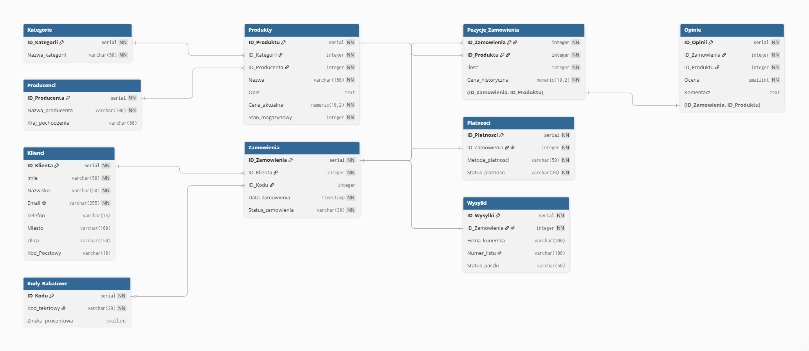
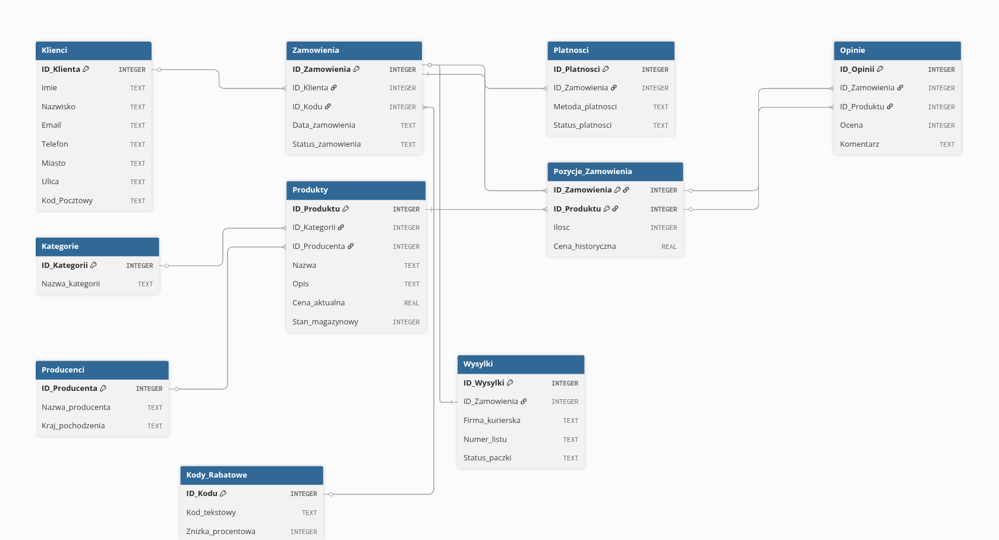

=========================================
Sprawozdanie: Implementacja Bazy Danych
=========================================

:Autorzy:
    1. Oskar Wrona
    2. Kamil Lewandowski
    3. Adam Tarkowski

1. Implementacja fizycznych schematów
=====================================

   Rysunek 4: Fizyczny schemat bazy danych opracowany dla silnika PostgreSQL.

   Rysunek 4: Fizyczny schemat bazy danych opracowany dla silnika SQLite.

Kod dla PGADMINA:
.. code-block:: sql
   -- =========================================
   -- TWORZENIE TABEL - SKLEP INTERNETOWY
   -- PostgreSQL / pgAdmin
   -- =========================================

   -- Usuwanie tabel jeśli istnieją
   DROP TABLE IF EXISTS Opinie CASCADE;
   DROP TABLE IF EXISTS Wysylki CASCADE;
   DROP TABLE IF EXISTS Platnosci CASCADE;
   DROP TABLE IF EXISTS Pozycje_Zamowienia CASCADE;
   DROP TABLE IF EXISTS Zamowienia CASCADE;
   DROP TABLE IF EXISTS Produkty CASCADE;
   DROP TABLE IF EXISTS Kody_Rabatowe CASCADE;
   DROP TABLE IF EXISTS Kategorie CASCADE;
   DROP TABLE IF EXISTS Producenci CASCADE;
   DROP TABLE IF EXISTS Klienci CASCADE;

   -- =========================================
   -- TABELA: Klienci
   -- =========================================
   CREATE TABLE Klienci (
      ID_Klienta SERIAL PRIMARY KEY,
      Imie VARCHAR(50) NOT NULL,
      Nazwisko VARCHAR(50) NOT NULL,
      Email VARCHAR(255) UNIQUE NOT NULL,
      Telefon VARCHAR(15),
      Miasto VARCHAR(100),
      Ulica VARCHAR(150),
      Kod_Pocztowy VARCHAR(10)
   );

   -- =========================================
   -- TABELA: Kategorie
   -- =========================================
   CREATE TABLE Kategorie (
      ID_Kategorii SERIAL PRIMARY KEY,
      Nazwa_kategorii VARCHAR(50) NOT NULL
   );

   -- =========================================
   -- TABELA: Producenci
   -- =========================================
   CREATE TABLE Producenci (
      ID_Producenta SERIAL PRIMARY KEY,
      Nazwa_producenta VARCHAR(100) NOT NULL,
      Kraj_pochodzenia VARCHAR(50)
   );

   -- =========================================
   -- TABELA: Kody_Rabatowe
   -- =========================================
   CREATE TABLE Kody_Rabatowe (
      ID_Kodu SERIAL PRIMARY KEY,
      Kod_tekstowy VARCHAR(20) UNIQUE NOT NULL,
      Znizka_procentowa SMALLINT CHECK (Znizka_procentowa BETWEEN 0 AND 100)
   );

   -- =========================================
   -- TABELA: Produkty
   -- =========================================
   CREATE TABLE Produkty (
      ID_Produktu SERIAL PRIMARY KEY,
      ID_Kategorii INTEGER,
      ID_Producenta INTEGER,
      Nazwa VARCHAR(150) NOT NULL,
      Opis TEXT,
      Cena_aktualna NUMERIC(10,2) NOT NULL CHECK (Cena_aktualna >= 0),
      Stan_magazynowy INTEGER NOT NULL DEFAULT 0 CHECK (Stan_magazynowy >= 0),

      CONSTRAINT fk_produkty_kategorie
         FOREIGN KEY (ID_Kategorii)
         REFERENCES Kategorie(ID_Kategorii)
         ON DELETE SET NULL,

      CONSTRAINT fk_produkty_producenci
         FOREIGN KEY (ID_Producenta)
         REFERENCES Producenci(ID_Producenta)
         ON DELETE SET NULL
   );

   -- =========================================
   -- TABELA: Zamowienia
   -- =========================================
   CREATE TABLE Zamowienia (
      ID_Zamowienia SERIAL PRIMARY KEY,
      ID_Klienta INTEGER NOT NULL,
      ID_Kodu INTEGER,
      Data_zamowienia TIMESTAMP DEFAULT CURRENT_TIMESTAMP,
      Status_zamowienia VARCHAR(30) NOT NULL,

      CONSTRAINT fk_zamowienia_klienci
         FOREIGN KEY (ID_Klienta)
         REFERENCES Klienci(ID_Klienta)
         ON DELETE CASCADE,

      CONSTRAINT fk_zamowienia_kody
         FOREIGN KEY (ID_Kodu)
         REFERENCES Kody_Rabatowe(ID_Kodu)
         ON DELETE SET NULL
   );

   -- =========================================
   -- TABELA: Platnosci
   -- =========================================
   CREATE TABLE Platnosci (
      ID_Platnosci SERIAL PRIMARY KEY,
      ID_Zamowienia INTEGER NOT NULL,
      Metoda_platnosci VARCHAR(50) NOT NULL,
      Status_platnosci VARCHAR(30) NOT NULL,

      CONSTRAINT fk_platnosci_zamowienia
         FOREIGN KEY (ID_Zamowienia)
         REFERENCES Zamowienia(ID_Zamowienia)
         ON DELETE CASCADE
   );

   -- =========================================
   -- TABELA: Pozycje_Zamowienia
   -- =========================================
   CREATE TABLE Pozycje_Zamowienia (
      ID_Zamowienia INTEGER NOT NULL,
      ID_Produktu INTEGER NOT NULL,
      Ilosc INTEGER NOT NULL CHECK (Ilosc > 0),
      Cena_historyczna NUMERIC(10,2) NOT NULL CHECK (Cena_historyczna >= 0),

      PRIMARY KEY (ID_Zamowienia, ID_Produktu),

      CONSTRAINT fk_pozycje_zamowienia
         FOREIGN KEY (ID_Zamowienia)
         REFERENCES Zamowienia(ID_Zamowienia)
         ON DELETE CASCADE,

      CONSTRAINT fk_pozycje_produkty
         FOREIGN KEY (ID_Produktu)
         REFERENCES Produkty(ID_Produktu)
         ON DELETE CASCADE
   );

   -- =========================================
   -- TABELA: Wysylki
   -- =========================================
   CREATE TABLE Wysylki (
      ID_Wysylki SERIAL PRIMARY KEY,
      ID_Zamowienia INTEGER NOT NULL,
      Firma_kurierska VARCHAR(100),
      Numer_listu VARCHAR(100),
      Status_paczki VARCHAR(50),

      CONSTRAINT fk_wysylki_zamowienia
         FOREIGN KEY (ID_Zamowienia)
         REFERENCES Zamowienia(ID_Zamowienia)
         ON DELETE CASCADE
   );

   -- =========================================
   -- TABELA: Opinie
   -- =========================================
   CREATE TABLE Opinie (
      ID_Opinii SERIAL PRIMARY KEY,
      ID_Zamowienia INTEGER NOT NULL,
      ID_Produktu INTEGER NOT NULL,
      Ocena SMALLINT NOT NULL CHECK (Ocena BETWEEN 1 AND 5),
      Komentarz TEXT,

      CONSTRAINT fk_opinie_pozycje
         FOREIGN KEY (ID_Zamowienia, ID_Produktu)
         REFERENCES Pozycje_Zamowienia(ID_Zamowienia, ID_Produktu)
         ON DELETE CASCADE
   );

   -- =========================================
   -- INDEKSY
   -- =========================================

   CREATE INDEX idx_produkty_kategoria
   ON Produkty(ID_Kategorii);

   CREATE INDEX idx_produkty_producent
   ON Produkty(ID_Producenta);

   CREATE INDEX idx_zamowienia_klient
   ON Zamowienia(ID_Klienta);

   CREATE INDEX idx_pozycje_produkt
   ON Pozycje_Zamowienia(ID_Produktu);

   CREATE INDEX idx_platnosci_zamowienie
   ON Platnosci(ID_Zamowienia);

   CREATE INDEX idx_wysylki_zamowienie
   ON Wysylki(ID_Zamowienia);

2. Skrypt do wprowadzania danych do bazy danych
===============================================
